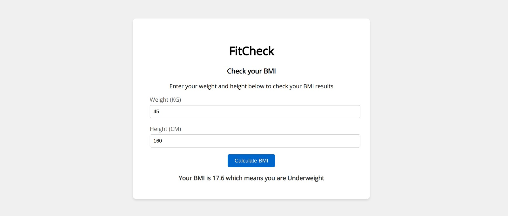

# FitCheck

FitCheck is a simple BMI (Body Mass Index) calculator web application that allows users to calculate their BMI based on their weight (in kilograms) and height (in centimeters). BMI is a widely-used indicator of a person's body weight in relation to their height and is a useful tool for assessing whether an individual falls within a healthy weight range.

The application provides a straightforward and user-friendly interface for inputting weight and height values, performing BMI calculations, and presenting the results. It also includes a BMI index table to help users interpret their BMI results.

## Features

- **Calculate BMI**: Enter your weight and height, and the app will instantly calculate your BMI.

- **BMI Interpretation**: The app provides an interpretation of the calculated BMI, categorizing it as "Underweight," "Healthy," "Overweight," or "Obese" based on established ranges.

- **User-Friendly Interface**: The app features a clean and intuitive design, making it easy for users to input their data and receive results.

- **Responsive Design**: FitCheck is designed to work well on various screen sizes, including mobile devices, tablets, and desktops.
